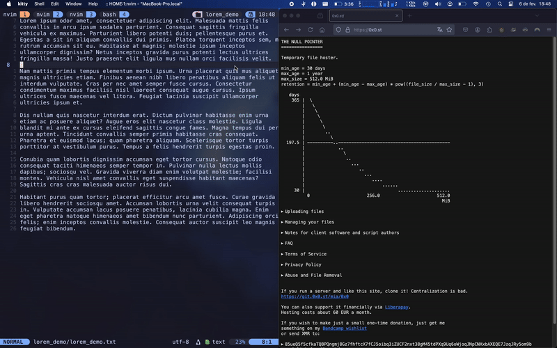
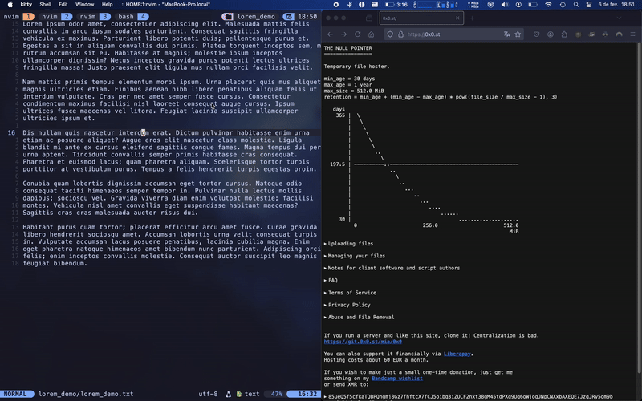
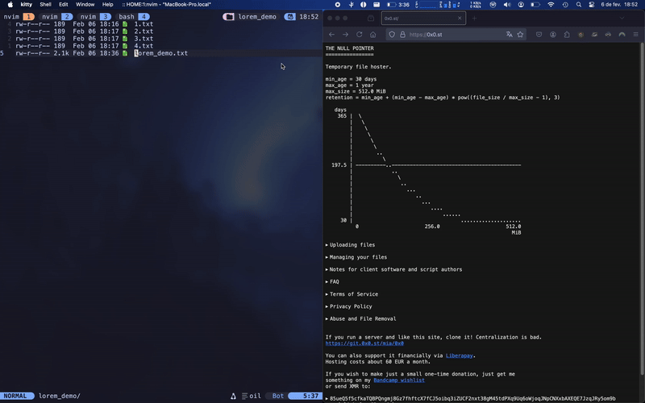

# nvim-0x0

A simple Neovim plugin to upload files, yanks, and selections to
[0x0.st](https://0x0.st).

## Obligatory Demos

- Uploading current opened file:
  

- Uploading visual selection:
  

- Uploading last yanked/deleted text:
  

- Uploading a file selected in `oil.nvim`:
  

- Uploading an image selected in `oil.nvim`:
  

## Installation

### Using lazy.nvim

Add the following to your `lazy.nvim` configuration:

```lua
require('lazy').setup({
  {
    "LionyxML/nvim-0x0",
    opts = {
      -- base_url = "https://<your-0x0-instance>/",  -- only needed if you host your own 0x0 instance
      use_default_keymaps = true,                    -- Set to false if you want to define your own keymaps
    }
  }
})
```

## Usage

By default, the following keybindings are available:

- `<leader>0f` — Upload the current file
- `<leader>0F` — Upload the current file (preserving original filename in URL)
- `<leader>0s` — Upload the current visual selection
- `<leader>0y` — Upload the last yank or delete content
- `<leader>0o` — Upload the file under cursor in `oil.nvim`
- `<leader>0O` — Upload the `oil.nvim` file (preserving original filename in URL)

These can be disabled by setting `use_default_keymaps = false` in the plugin setup.

If you'd prefer to use your own mappings, here's how you can set them up:

```lua
vim.keymap.set('n', '<leader>uf', require("nvim-0x0").upload_current_file, { desc = "Upload current file" })
vim.keymap.set('n', '<leader>uF', function()
  require("nvim-0x0").upload_current_file({ append_filename = true })
end, { desc = "Upload current file (preserve filename)" })
vim.keymap.set('v', '<leader>us', require("nvim-0x0").upload_selection, { desc = "Upload selection" })
vim.keymap.set('n', '<leader>uy', require("nvim-0x0").upload_yank, { desc = "Upload yank" })
vim.keymap.set('n', '<leader>uo', require("nvim-0x0").upload_oil_file, { desc = "Upload oil.nvim file" })
vim.keymap.set('n', '<leader>uO', function()
  require("nvim-0x0").upload_oil_file({ append_filename = true })
end, { desc = "Upload oil.nvim file (preserve filename)" })
```

If you'd like to host your own instance of 0x0, set `base_url =
"https://0x0.st/"`.

## Contributing

Contributions are welcome! Please follow these steps:

1. Fork the repository.
2. Create a new branch for your changes.
3. Make your modifications and ensure they follow the project's style.
4. Submit a pull request with a clear description of your changes.

## License

This project is licensed under the GPL-2.0. See the [LICENSE](LICENSE) file for
details.
